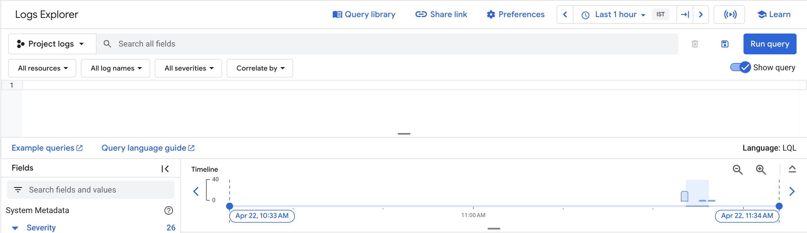
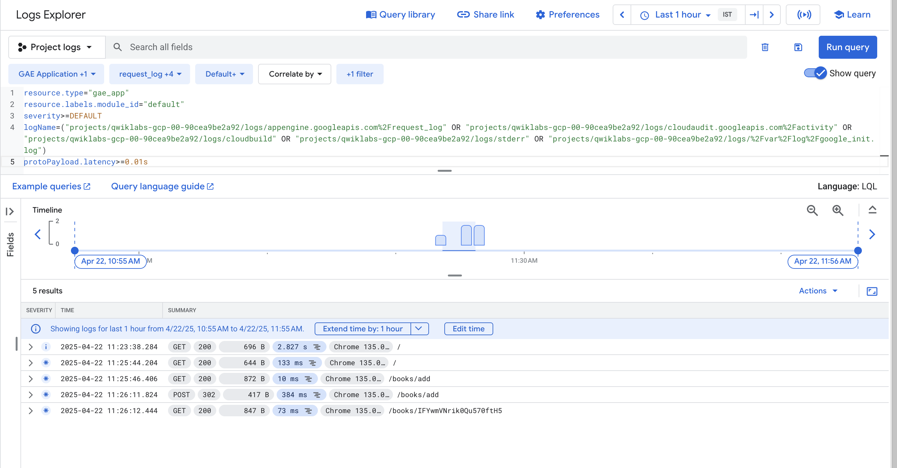
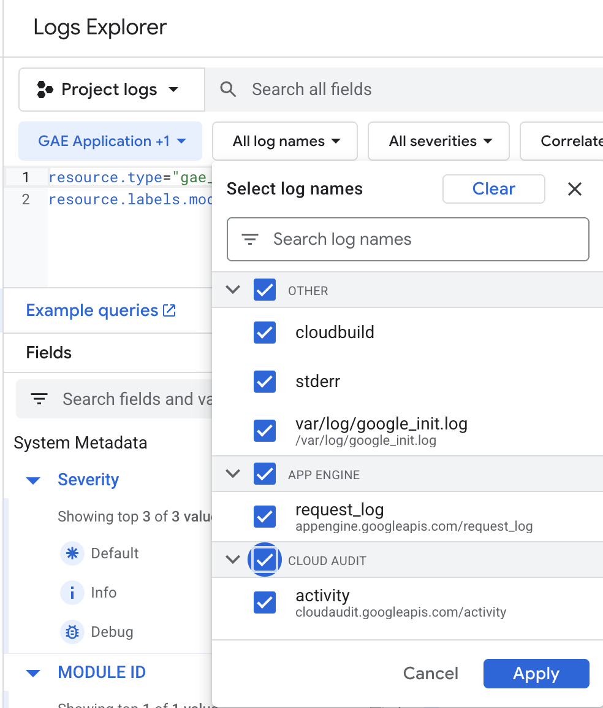
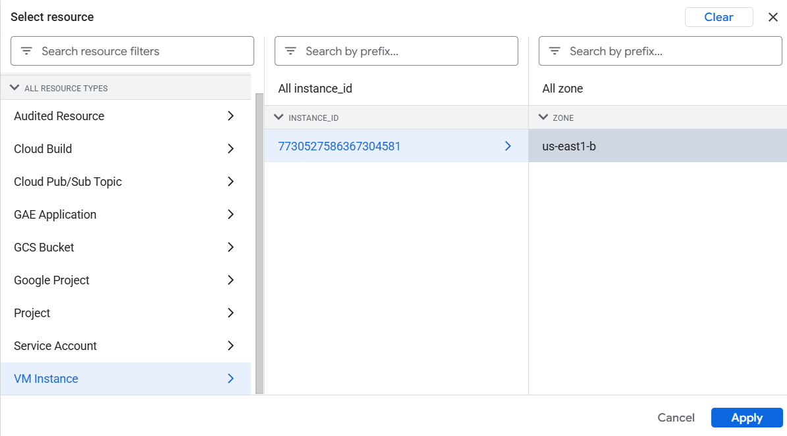
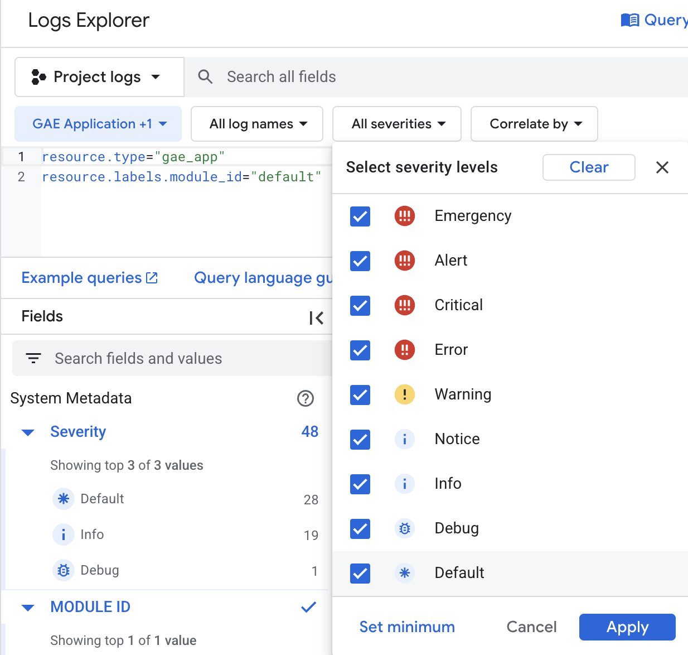
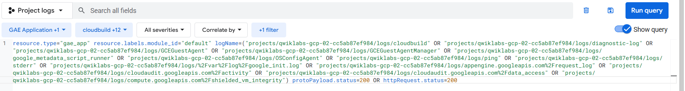
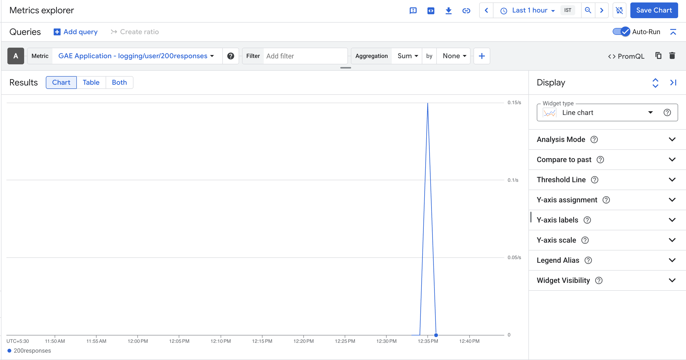
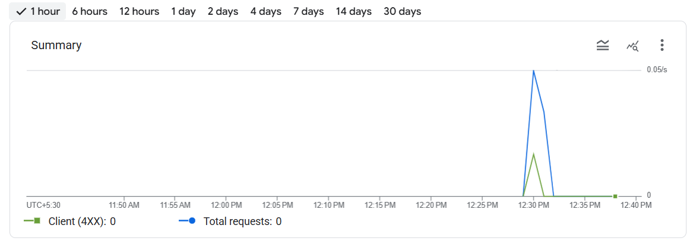

```
 ██████╗██╗      ██████╗ ██╗   ██╗██████╗
██╔════╝██║     ██╔═══██╗██║   ██║██╔══██╗
██║     ██║     ██║   ██║██║   ██║██║  ██║
██║     ██║     ██║   ██║██║   ██║██║  ██║
╚██████╗███████╗╚██████╔╝╚██████╔╝██████╔╝
 ╚═════╝╚══════╝ ╚═════╝  ╚═════╝ ╚═════╝

██╗      ██████╗  ██████╗  ██████╗ ██╗███╗   ██╗ ██████╗
██║     ██╔═══██╗██╔════╝ ██╔════╝ ██║████╗  ██║██╔════╝
██║     ██║   ██║██║  ███╗██║  ███╗██║██╔██╗ ██║██║  ███╗
██║     ██║   ██║██║   ██║██║   ██║██║██║╚██╗██║██║   ██║
███████╗╚██████╔╝╚██████╔╝╚██████╔╝██║██║ ╚████║╚██████╔╝
╚══════╝ ╚═════╝  ╚═════╝  ╚═════╝ ╚═╝╚═╝  ╚═══╝ ╚═════╝
```

<div align="center">

# Configuring Cloud Logging & Security Monitoring

*Centralized log analysis and security event investigation on Google Cloud Platform*

</div>

---

&nbsp;

```
═══════════════════════════════════════════════════════
OVERVIEW
═══════════════════════════════════════════════════════
```

## Overview

This project delivers hands-on experience in cloud security monitoring and log analysis using Google Cloud Platform's native logging infrastructure. By leveraging the Logs Explorer interface and structured log queries, the project simulates real-world SOC workflows — ingesting, filtering, and investigating cloud-generated events across compute resources and application services.

The work demonstrates how security teams gain visibility into cloud activity, prioritize critical incidents using severity-based filtering, and extract actionable intelligence from raw log data.

&nbsp;

---

```
═══════════════════════════════════════════════════════
OBJECTIVES
═══════════════════════════════════════════════════════
```

## Objectives

- Analyze cloud-generated logs using Google Cloud Logging and Logs Explorer
- Filter log data by resource type to isolate Compute Engine (VM) activity
- Apply severity-based filtering to prioritize high-impact security events
- Construct structured log queries to surface security-relevant entries
- Simulate SOC-style incident investigation using log metadata
- Demonstrate centralized visibility across cloud services and infrastructure

&nbsp;

---

```
═══════════════════════════════════════════════════════
TOOLS & TECHNOLOGIES
═══════════════════════════════════════════════════════
```

## Tools & Technologies


&nbsp;

---

```
═══════════════════════════════════════════════════════
PROJECT STRUCTURE
═══════════════════════════════════════════════════════
```

## Project Structure

```
Cloud-Logging-Security-Monitoring/
│── README.md
│── Report/
│   └── Configuring_Cloud_Logging___Security_Monitoring.pdf
│── Screenshots/
│   ├── logs-explorer.png
│   ├── log-entries.png
│   ├── log-filter.png
│   ├── vm-resource-selection.png
│   ├── severity-filter.png
│   ├── log-queries.png
│   ├── log-metrics.png
│   └── instances-activity.png
```

&nbsp;

---

```
═══════════════════════════════════════════════════════
METHODOLOGY
═══════════════════════════════════════════════════════
```

## Methodology

&nbsp;

### Step 1 — Cloud Logging Environment Access

Google Cloud Logging was accessed via the Google Cloud Console. Logging is enabled by default in GCP, providing immediate visibility into activity across all cloud resources without manual configuration.

&nbsp;

### Step 2 — Accessing Logs Explorer

Logs Explorer served as the primary interface for querying, viewing, and analyzing log streams generated by cloud services. Its centralized design is critical for operational monitoring and security investigations.

&nbsp;

### Step 3 — Viewing Cloud Log Entries

Multiple live log entries were observed across services, including system-level activity, API operations, and resource-level events. This confirmed active log ingestion and validated the environment's monitoring readiness.

&nbsp;

### Step 4 — Filtering Logs by Compute Engine (VM)

Logs were scoped to display only Compute Engine (Virtual Machine) logs using resource-type filtering. This technique reduces noise, isolates asset-specific activity, and mirrors real-world analyst workflows when investigating specific infrastructure components.

&nbsp;

### Step 5 — Severity-Based Log Filtering

Severity levels — including **WARNING**, **ERROR**, and **CRITICAL** — were applied to further refine log results. Severity-based filtering enables rapid triage of high-impact events and accelerates incident prioritization.

&nbsp;

### Step 6 — Log Analysis Using Structured Queries

Structured log queries in Logs Explorer were constructed to filter across resource type, severity level, and service-generated events simultaneously. This query-driven approach isolates actionable data from high-volume log streams — a foundational practice in SOC operations.

&nbsp;

---

```
═══════════════════════════════════════════════════════
RESULTS & SCREENSHOTS
═══════════════════════════════════════════════════════
```

## Results & Screenshots

&nbsp;

### Logs Explorer Interface



Initial view of the Logs Explorer interface showing the query panel, timeline, and system metadata fields with severity breakdown across the project.

&nbsp;

---

### Live Log Entries



Active log entries captured from the GAE Application resource, showing request logs with HTTP methods, status codes, response sizes, latencies, and endpoint paths. Five filtered results are returned across the monitored window.

&nbsp;

---

### Log Name Filter



Log name selection panel displaying available log sources grouped by category — including Cloud Audit, App Engine, and Other (cloudbuild, stderr, google_init.log). All sources are selected for comprehensive visibility.

&nbsp;

---

### VM Resource Selection



Resource filter drill-down showing the VM Instance selected from the resource type list, with instance ID `7730527586367304581` identified in zone `us-east1-b`.

&nbsp;

---

### Severity-Level Filter



Severity selection panel showing all levels from Emergency through Default available for filtering. The metadata panel confirms 48 total log entries with Default (28), Info (19), and Debug (1) as the top three severity distributions.

&nbsp;

---

### Structured Log Query



A complex structured query targeting GAE Application resources with multiple log name sources and a compound status filter (`protoPayload.status=200 OR httpRequest.status=200`), used to surface successful HTTP responses across all instrumented services.

&nbsp;

---

### Log-Based Metric



Metrics Explorer view displaying the `logging/user/200responses` metric for the GAE Application, visualized as a line chart. A single request spike is visible at approximately 12:35 PM, reaching 0.15/s.

&nbsp;

---

### Instance Activity Summary



One-hour activity summary chart showing Client (4XX) errors against Total requests. A brief spike is observed around 12:30 PM, peaking at 0.05/s, followed by zero activity — indicating a short burst of requests with no sustained traffic.

&nbsp;

---

```
═══════════════════════════════════════════════════════
QUERIES & FILTERS USED
═══════════════════════════════════════════════════════
```

## Queries & Filters Used

**Filter by GAE Application resource and default module:**
```lql
resource.type="gae_app"
resource.labels.module_id="default"
```

**Severity threshold filter:**
```lql
severity>=DEFAULT
```

**Latency-based filter:**
```lql
protoPayload.latency>=0.01s
```

**HTTP status code filter (compound):**
```lql
protoPayload.status=200 OR httpRequest.status=200
```

**Full multi-source log name filter with status query:**
```lql
resource.type="gae_app"
resource.labels.module_id="default"
logName=("projects/<PROJECT_ID>/logs/cloudbuild" OR
         "projects/<PROJECT_ID>/logs/GCEGuestAgent" OR
         "projects/<PROJECT_ID>/logs/OSConfigAgent" OR
         "projects/<PROJECT_ID>/logs/ping" OR
         "projects/<PROJECT_ID>/logs/stderr" OR
         "projects/<PROJECT_ID>/logs/appengine.googleapis.com%2Frequest_log" OR
         "projects/<PROJECT_ID>/logs/cloudaudit.googleapis.com%2Factivity" OR
         "projects/<PROJECT_ID>/logs/cloudaudit.googleapis.com%2Fdata_access" OR
         "projects/<PROJECT_ID>/logs/compute.googleapis.com%2Fshielded_vm_integrity")
protoPayload.status=200 OR httpRequest.status=200
```

&nbsp;

---

```
═══════════════════════════════════════════════════════
DOCUMENTATION
═══════════════════════════════════════════════════════
```

## Documentation

[Download Full Report](Report/Configuring_Cloud_Logging___Security_Monitoring.pdf)

&nbsp;

---

```
═══════════════════════════════════════════════════════
KEY OBSERVATIONS
═══════════════════════════════════════════════════════
```

## Key Observations

- **Centralized visibility** — Cloud Logging aggregates events across all GCP services into a single queryable interface without requiring custom instrumentation
- **Resource isolation** — VM-level filtering enables precise investigation of specific infrastructure components, reducing irrelevant log volume
- **Severity triage** — Structured severity levels allow security teams to surface actionable events rapidly without parsing raw log streams
- **Query precision** — LQL-based queries combining resource type, log names, and payload fields provide granular control over log analysis scope
- **SOC applicability** — The workflow demonstrated directly maps to real-world security operations: ingest, filter, query, investigate

&nbsp;

---

```
═══════════════════════════════════════════════════════
CONCLUSION
═══════════════════════════════════════════════════════
```

## Conclusion

This project successfully demonstrated end-to-end cloud security log analysis using Google Cloud Logging and Logs Explorer. Through resource-level and severity-based filtering combined with structured LQL queries, security-relevant events were isolated from high-volume log streams and investigated in a manner consistent with SOC analyst workflows.

The experience reinforced the operational importance of centralized logging in cloud environments — where rapid visibility, noise reduction, and evidence preservation are essential to effective security monitoring and incident response.

&nbsp;

---

<div align="center">

Developed as part of a personal cloud security portfolio project

</div>
